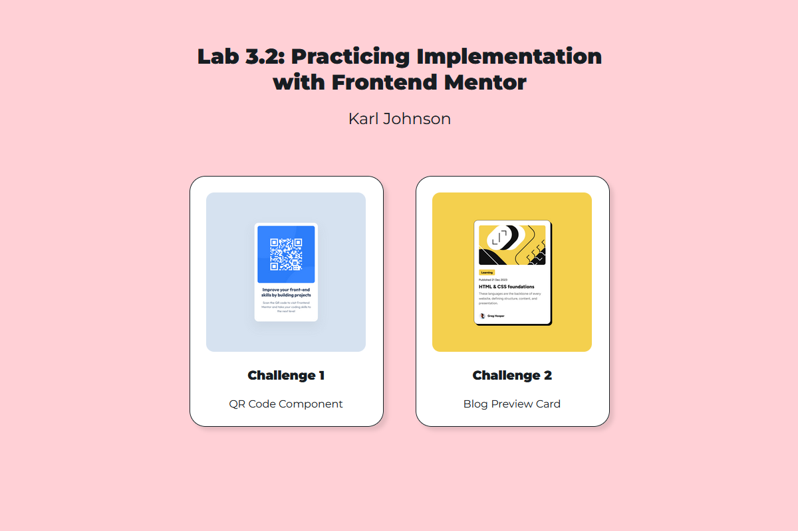

# Lab 3.2: Practicing Implementation with Frontend Mentor

[Karl Johnson](https://github.com/hirekarl/)  
2025-RTT-30  
<date datetime="2025-06-12">2025-06-12</date>  

---

## Overview
## Viewer Instructions

### Deployments
1. TODO
2. TODO
3. TODO

### Source
1. [Challenge 1: QR Code Component](./01_qr_code_component/index.html)
2. [Challenge 2: Blog Preview Card](./02_blog_preview_card/index.html)
3. ~~Challenge 3: Space Tourism Multi-Page Website~~ (*in progress*)

### Scenario
In a professional setting, developers often work from detailed Figma designs to build high-quality, pixel-perfect web components. To strengthen your development skills, this lab will introduce you to Frontend Mentor, a tool providing real-world coding challenges. Frontend Mentor will help you practice translating Figma designs into HTML and CSS and give you a taste of professional front-end development workflows. The hands-on challenges will enhance your proficiency with core web development tools and refine your ability to implement design specifications accurately.

### Objectives
By the end of this lab, you will be able to:

- Create an account and navigate the Frontend Mentor platform.
- Complete two foundational Frontend Mentor challenges using HTML and CSS.
- Optionally complete additional challenges to build more complex web components.

### Challenges
1. Required: [QR Code Component Challenge](https://www.frontendmentor.io/challenges/qr-code-component-iux_sIO_H)
2. Required: [Blog Preview Card](https://www.frontendmentor.io/challenges/blog-preview-card-ckPaj01IcS)
3. Optional: [Space Tourism Multi-Page Website](https://www.frontendmentor.io/challenges/space-tourism-multipage-website-gRWj1URZ3)

## Reflection Questions
After completing these challenges, take a few minutes to answer the following questions:

1. How did using Figma designs as references affect your coding process?

2. What challenges did you encounter when aligning your code with the design specifications?

3. How can the feedback and community resources on Frontend Mentor help you improve as a developer?
